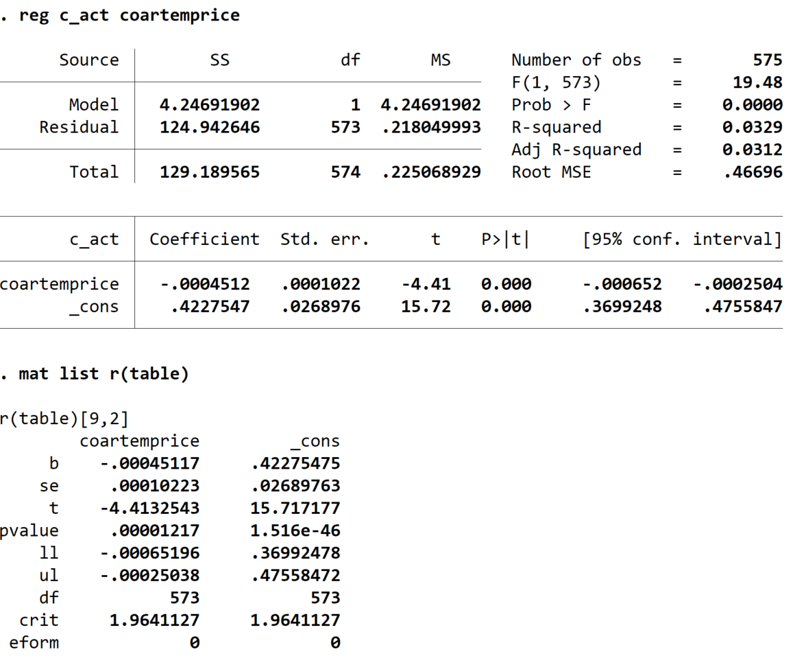

# A Fully Customizable Regression Table

Before you begin, set up a do file that 
downloads data from the paper 
[Price Subsidies, Diagnostic Tests, and Targeting of Malaria Treatment: Evidence from a Randomized Controlled Trial](https://www.aeaweb.org/articles?id=10.1257/aer.20130267) by following the instructions [here](https://pjakiela.github.io/stata/making-tables.html).

<br>

## Regression Results

Immediately after you run a regression in Stata, your results are saved in 
a collection of local macros and matrices.  You can see what is saved 
by typing `return list` and `ereturn list` immediately after running a regression.  So, 
for example, if we run the regression 
```reg c_act coartemprice b_*```
to regress the dummy for treating malaria with ACT (`c_act`) on the randomly assigned price (`coartemprice`) and 
all of the baseline convariates (with variables names beginning with `b_`), Stata will report the coefficients, 
standard errors, p-values, and confidence intervals for the eight independent variables plus the constant, and it 
will also report a range of regression diagnostics such as the number of observations, the R-squared, and the 
root mean-squared error.  If you type 
```ereturn list```
immediately after running your regression, Stata will provide a list of what it calls e-class results - local macros 
and matrices containing the results of the regression.  For example, the local `e(N)` is the number of observations 
(from the last regression Stata ran), and the matrix `e(b)` is a vector of estimated regression coefficients.  

A particularly useful matrix is `r(table)`, which is where Stata stores all of the statistics related to regression coefficients (the 
coefficient estimates themselves as well as standard errors, t-statistics, p-values, and confidence intervals).  For example, 
the code 
```
reg c_act coartemprice
mat list r(table)
```
first regresses `c_act` on `coartemprice` and then uses the `matrix list` (`mat list` for short) command to have Stata display 
the regression results.  We'll see the following output:



All of these e-class results are over-written as soon as you run another regression - so we need to save them somewhere if we want 
to be able to access them later.

<br>
