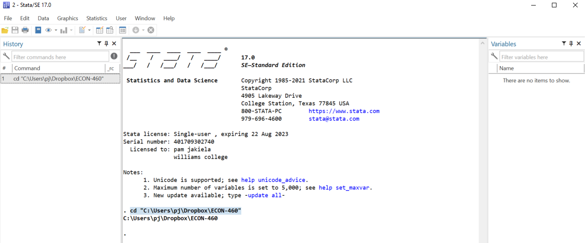

# Making Tables in Stata

To get started, create a do file that begins with 
```
clear all
set more off
```
and then includes a `cd` command to change Stata's working directory to the folder 
on your computer where you want to save the tables you're about to make.  It is a good idea 
to also include a comment (a line that begins with `//` or `*`) where you describe the purpose of your 
do file.

If you are unsure of the file path to your prefered folder or directory, choose 
**Change Working Directory** from Stata's file menu and then select your preferred 
folder that way.  When Stata executes this command, you will see that a command beginning with 
`cd` will appear in your Stata output window, as though you typed it yourself (as in the image below).  That will tell you 
the file path to your preferred folder.  From now on, you can simply include that `cd` command 
near the top of your do file - you won't have to choose **Change Working Directory** from the 
file menu again.



Each of the examples below uses data from the
paper [Price Subsidies, Diagnostic Tests, and Targeting of Malaria Treatment: Evidence from a Randomized Controlled Trial](https://www.aeaweb.org/articles?id=10.1257/aer.20130267) 
by Jessica Cohen, Pascaline Dupas, and Simone Schaner, published in the _American Economic Review_ in 2015. The authors 
examine behavioral responses to various discounts (“subsidies”) for malaria treatment, called “artemisinin combination therapy” 
or “ACT.” An overview of the randomized evalaution is available 
[here](https://www.povertyactionlab.org/sites/default/files/publication/2011.12.15-Subsidizing-Malaria.pdf).

You can either download the [data set](https://pjakiela.github.io/ECON523/exercises/E1-CohenEtAl-data.dta) and 
save it to your working director (or another folder if you prefer).  If you do this, you can load your data into 
Stata using the `use` command.  Alternatively, you can use the code
```
webuse set https://pjakiela.github.io/ECON523/exercises
webuse E1-CohenEtAl-data.dta
```
to load your data directly from the web.

Once you have a do file that loads your data, take a minute to familiarize yourself 
with the data set.  How many observations does it contain?  How many variables?  

<br>

