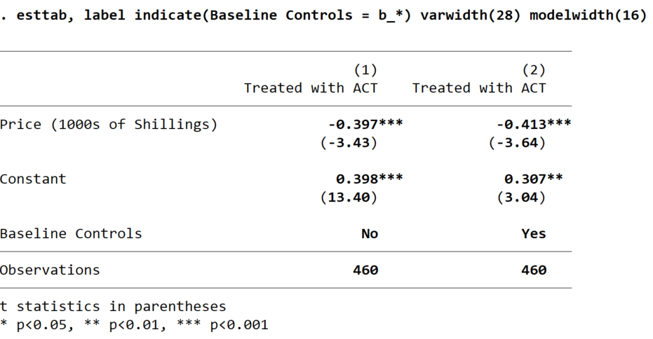

# A Regression Table

The stata commands `eststo` and `esttab` allow you to make attractive, 
self-contained tables with very little effort.  Before you begin, set up a do file that 
downloads data from the paper 
[Price Subsidies, Diagnostic Tests, and Targeting of Malaria Treatment: Evidence from a Randomized Controlled Trial](https://www.aeaweb.org/articles?id=10.1257/aer.20130267) by following the instructions [here](https://pjakiela.github.io/stata/making-tables.html).

<br>

## Storing Regression Results with `eststo`

`eststo` is a Stata command that allows you to save the results of a regression.  Immediately after you run 
any regression, your results are saved in a collection of local macros and matrices (you can see what is saved 
by typing `ereturn` `list` immediately after running your regression).  These locals are 
over-written as soon as you run another regression - so we need to save them somewhere.  That is what `eststo` does.

`eststo` is very easy to use.  You can simply type `eststo` after running any regression.  Alternatively, you can precede 
each regression command with `eststo:`, as you see in this example:
```
eststo:  reg c_act coartemprice
```
By default, `eststo` saves the results from your first regression as `est1`, the results from your second regression 
as `est2`, etc.  But you can provide alternative names if you prefer:  just type `eststo` followed by your preferred name 
for a particular specification (either after running the regression or before the colon in a single line of code).  

To see which regression results are currently stored in memory, type `eststo` `dir`.  The erase them and start fresh, 
type `eststo` `clear`.  It is worth taking a look at the help file for `eststo` to familiarize yourself with its syntax before proceeding.

<br>

## Exporting Regression Results to Word
 
Suppose you run the following regressions and you want to export your results as a regression table:
```
eststo clear
eststo:  reg c_act coartemprice
eststo:  reg c_act coartemprice b_*
```
Simply typing `esttab` after storing the results of these regressions will produce a decent-looking regression table 
in Stata's output window:


If you want to export this table to a word document, you can use the command 
```
esttab using myregtable.rtf, replace
```
which will save a rich text format (rtf) file in your working directory, which you can then open using word.

<br>

## Publication-Ready Tables

You can clean up your table by labeling your variables using the `label var` command (note:  you must 
do this **before** you run your regressions).  When variable names appear in otherwise finished tables, 
readers often have a hard time knowing what the variables are:  names like `b_dist_km` 
or `txpostxfem` may not be immediately self-eplanatory.  And they do not look very professional.  If 
your variables are labeled, you can invoke `esttab`'s `label` option to use labels rather than variable names.  

Variable labels should be short, so that they do not wrap over multiple lines in your table.  They should also be 
self-expanatory. You can include additional information in the table notes when necessary.  

If you have categorical variables that can be replaced with easier-to-interpret dummy variables, this might be a good 
opportunity to transform them.  So, for example, you can include a rural dummy labeled "Rural" instead of 
a `region` variable labeled "Region of residence:  urban = 1, rural = 2".  This will make it easier for 
readers to immediately interpret your regression coefficients.

Having relabeled the data, you can use `esttab` to generate a new version of your regression table.  If the text of 
your variable labels wraps onto a second line, you can make the first column of the table wider using `esttab`'s 
`varwidth()` option.  In the example below, I used `varwidth(28)`  You can also set the width of your columns of coefficient estimates 
using the `modelwidth()` option.  I used `modelwidth(16)`.  It's not clear what the units are, 
but higher numbers lead to wider columns.  This gives you a fairly professional looking table:

 

Before publishing this table, you'd want to find out why your two regression specifications include 
different numbers of observations.  Otherwise, you won't know whether any difference in the coefficient of interest 
between Column 1 and Column 2 results from adding the controls or changing your analysis sample.  You should 
always make sure that the columns in your regression tables contain identical numbers of observations (unless you 
are varying the sample intentionally, for example if you were looking at treatment effects on women in one column and treatment effects 
on men in another column).

You might also notice that the coefficient estimates associated with with `coartemprice` variable are very long - the begin 
with three zeroes after the decimal point.  To correct this, simply divide the `coartemprice` variable by 100 (or even 1000) before 
running your regressions.  This will not alter any of your other coefficients, but it will rescale the coefficients on price 
so that they fit into the table more easily.  (Of course, this changes the interpretation slightly:  the coefficient 
would then indicate the change in your outcome variable resulting from a 100 shilling increase in the price of coartem 
rather than a one shilling price increase.)

<br>

## Additional Options in `esttab`

Economists typically report standard errors rather than t-statistics in parentheses.  You can 
achieve this by invoking `esttab`'s `se` option.  If you want to specify how many digits 
to report, you can do this adding a number in partheses after either `b` (for the coefficient 
estimates) or `se` (for the standard errors).  So, if for some reason you wished to report 
coefficient estimates to two decimal places and standard errors to three, you would use 
the command
```
esttab, b(2) se(3)
```

You can change the headings of the columns reporting regression coefficients with `esttab`'s 
`mtitles()` option. By default, columns of coefficients will be numbered, and either the name 
of the dependent variable or its label will appear as well.  However, when the outcome variable does not 
differ across columns, it often makes more sense to use more informative columns headings.  For example, 
if your first specification was OLS and your second specification was probit, you might want to label 
your columns accordingly:
```
esttab, mtitles(OLS Probit)
```
If you wish to use multi-word column headings, you can put each one in quotes.  For example:
```
esttab, mtitles("Rural Areas" "Urban Areas")
```

You may not always want to report the coefficients on your control variables - particularly when 
your specification includes a large number of fixed effects.  The `esttab` option `keep()` allows 
you to provide a list (in parentheses) of the variables that you want to appear in your table.  Alternatively, 
you can use the option `drop()` to indicate which variables should be surpressed.  The option 
`indicate()` drops a specific set of variables from the table (like `drop()`) but also creates an additional 
row at the bottom of the table indicating which specifications include the dropped variables.  For example:
```
eststo clear
eststo:  reg c_act coartemprice
eststo:  reg c_act coartemprice b_*
esttab, label drop(Baseline Controls = b_*) replace
```
produces the table below.



You can also use the 
`note()` option to add any relevant information in the table notes.


r keeping only the coefficients on price using the `keep` option.  

<br>

## Exporting Regression Results to LaTeX or Excel

The `esttab` command can also be used to export regression results to 
Excel or LaTeX.  To export to Excel, just name your new file as a csv file rather 
than an rtf file:
```
esttab using myregtable.csv, replace
```
A nice thing about exporting to Excel is that you can make additional modifications 
(for example, to format borders) using the `putexcel` command.

`esttab` can also export your table to LaTeX - all you need to do 
is give your new file a name that ends in tex.  For example, 
if you export your regression results using the code 
```
esttab using myregtable.tex, label b(2) se(2) nostar replace ///
   title(Regression table\label{tab1})
 ```
you can compile a pdf of the table in overleaf or any other LaTeX compiler 
with the LaTeX code:
```
\documentclass[12pt]{article}
\begin{document}
\input{myregtable.tex}
\end{document}
```

<br>

## A do File

A do file containing the code used in these examples is available 
[here](reg-table-example.do).
