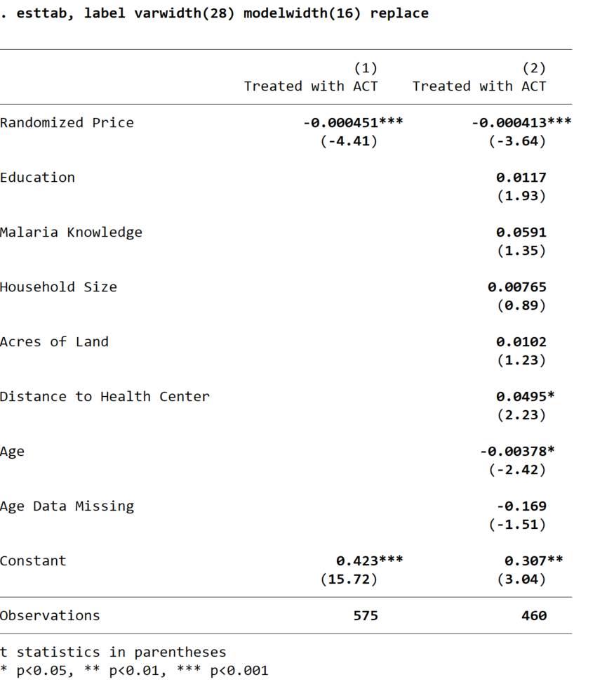

# A Regression Table

The stata commands `eststo` and `esttab` allow you to make attractive, 
self-contained tables with very little effort.  Before you begin, set up a do file that 
downloads your data by following the instructions [here](https://pjakiela.github.io/stata/making-tables.html).

<br>

## Storing Regression Results with `eststo`

`eststo` is a Stata command that allows you to save the results of a regression.  Immediately after you run 
any regression, your results are saved in a collection of local macros and matrices (you can see what is saved 
by typing `return list` and `ereturn list` immediately after running your regreession).  These locals are 
over-written as soon as you run another regression - so we need to save them somewhere.  This is what `eststo` does.

`eststo` is very easy to use.  You can simply type `eststo` after running any regression.  Alternatively, you can preceed 
each regression command with `eststo:`, as you can see in this example:
```
eststo:  c_act coartemprice
```
By default, `eststo` saves the results from your first regression as `est1`, the results from your second regression 
as `est2`, est.  But you can provide alternative names if you prefer:  just type `eststo` followed by your preferred name 
for a particular specification (either after running the regression or before the colon in a single line of code).

To see which regression results are currently stored in memory, type `eststo dir`.  The erase them and start fresh, 
type `eststo clear`.  It is worth taking a look at the help file for `eststo` to familiarize yourself with its syntax before proceeding.

<br>

## Exporting Regression Results
 
Suppose you run the following regressions and you want to export your results as a regression table:
```
eststo clear
eststo:  reg c_act coartemprice
eststo:  reg c_act coartemprice b_*
```
Simply typing `esttab` after storing the results of these regressions will produce a decent-looking regression table 
in Stata's output window:


If you want to export this table to a word document, you can instead used the command 
```
esttab using myregtable.rtf, replace
```
which will save a rich text format file in your working directory, which you can then open using word.

We can clean the table up considerably by labeling our variables using the `label var` command.  Labels 
should be short, so that they do not wrap over multiple lines in your table.  They should also be self-expanatory, 
though you can include additional information in the table notes when necessary.  

Having relabeled the data, I can use `esttab` to generate a new version of my regression table.  By playing 
around with `esttab`'s `varwidth()` and `modelwidth()` options, I can make sure that my columns are wide enough 
to contain my variable labels.  This gives me a fairly professional looking table:

 
