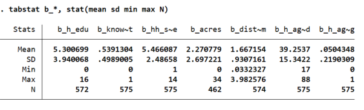
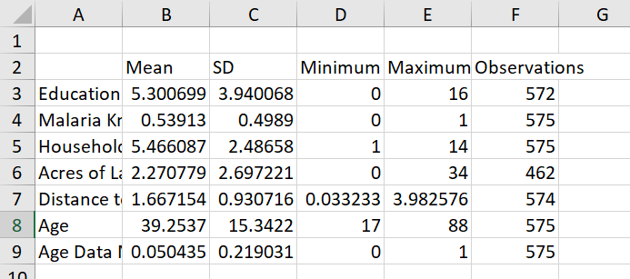

# A Summary Statistics Table

The data set contains 7 baseline variables, each of which begins with the prefix `b_`.  Use the 
command
```
describe b_*
```
to list these variables along with their labels (`*` is a wildcard:  it tells Stata to look for all variables 
that begin with `b_`, regardless of what comes next).  These variables contain information about 
the characteristics of households in the sample measured prior to the start of the 
randomized trial.  
 
If you type the command 
```
sum b_*
``` 
Stata will report summary statistics about the baseline variables.  Which summary statistics are reported?  

<br>

## Stata's `tabstat` Command

One of the sumplest ways to export a similar table to Word or Excel is to use the `tabstat` command.  Try 
typing the command 
```
tabstat b_*
```
to see one way that `tabstat` can work.  We are going to make a summary statistics table that contains 
the mean, the standard deviation, the minimum and maximum values, and the number of observations for each 
baseline variable.  Try to use the help file to figure out how to get `tabstat` to report all of these 
statistics in one table.

Once you succeed, your Stata output will probably look something like this:
  
This **is** a table reporting the summary statistics that we are interested in, but it is not 
something that we would like to include in one of our papers!  Because the variable names are 
truncated, we can't even tell which variables are included.  However, if you try adding 
`col(stat) save` at the end of your `tabstat` command, your output should look better - and your results 
will be temporarily saved in Stata's local memory as the matrix `r(StatTotal)`.

<br>

## Saving `tabstat` Results as a Matrix

When you use `tabstat` with the `save` option, Stata automatically stores your summary statistics 
in a local matrix called `r(StatTotal)`.  To keep those results from disappearing when you run another command, 
we need to save them in a new matrix with a name of our choosing.  We can do this by using the commands
```
mat mystats = r(StatTotal)
```
where `mat` is short for matrix.  To see what is contained in the matrix `mystats`, type:
```
mat list mystats
```
Unfortunately, this matrix doesn't look exactly the way we want our summary statistics table to look:  even 
though we used the `col(stat)` option with `tabstat`, the different variables are columns rather than rows 
in our matrix; and the variable names are not self-explanatory.  

We can fix this in two steps.  First, we need to transpose our `mystats` matrix by adding the command 
```
matrix mystats = matrix(mystats)'
```
to our do file.  Use the `mat list` command again to see that our matrix is now set up correctly.  

We can also use the commands `matrix rownames` and `matrix colnames` to change the names associated 
with the rows and columns of our matrix.  For example, we could change the headings of the last 
three columns from **Max**, **Min**, and **N** to **Maximum**, **Minimum**, and **Observations** using the command
```
matrix colnames mystats = Mean SD Minimum Maximum Observations
```
If you want to use a column or row label that contains multiple words, you can put it in quotes:
```
matrix colnames mystats = Mean "Standard Deviation" Minimum Maximum Observations
```
Try replacing the row names with short, appropriate, self-contained labels for each variable.

<br>

## Exporting a Table to Excel

Now that you have your results stored in a Stata matrix, you can export it to Excel 
using the `putexcel` command (in fact, `putexcel` is a useful command for exporting matrices 
or individual statistics - read the help file!).

We start with a `putexcel set` step, which tells Stata the name of the Excel file where we want 
to write our results.  So, for example, to create an Excel file called `mysummstats.xlsx`, we could type 
```
putexcel set mysummstats.xlsx, replace
```
This file will appear in the working directory once we write something to it (which is why 
it is important to set your working directory carefully).  The second `putexcel` step is very 
straightforward:  the command is `putexcel` followed by the coordinates of the cell where we want to put 
the upper left corner of our matrix; then after the equal sign, we call our matrix.  So, we could type:
```
putexcel A2 = matrix(mystats), names 
```
The `names` option tell Excel to use the row and column names that we so painstakingly added 
to the `mystats` matrix.  

Try this.  If you run your do file from the top, you should see an Excel file that looks something like this:
  
Not bad, but still not exactly what we're looking for.  How can we improve the table?

One way to truncate numbers is to use the `matmap` function in Stata.  `matmap` allows you to apply a Stata function, 
in this case the `round` function, to every cell of a Stata matrix.  The command
```
matmap mystats roundstats, map(round(@,0.01))
```
generates a new Stata matrix, `roundstats` which rounds numbers to the nearest 0.01.  We can then export this matrix 
to Excel (over-writing `mystats`) using the `putexcel` command.

One nice thing about `putexcel` is that we can modify the formatting after we've exported out main results matrix.  So, 
to add a border to the bottom of the table, we could use the command
```
putexcel A9:F9, border(bottom)
```
You can use similar code to add a border to the top, add a title across the row of cells above the table, or apply other 
formatting.  it is worth exploring the help file to see what else you can do.

## Exporting a Table to Word

If you prefer to export your table to Microsoft Word, you can do that using the `putdocx` command - but be aware 
that it is much less flexible than `putexcel`.  The operation of writing your table to a word document all occurs in one step,
so you can't modify table formatting or add a title or notes after the fact.  If we wanted to export our summary statistics 
table to word, we could use the code
```
putdocx clear
putdocx begin
putdocx table tbl1 = matrix(roundstats), rownames colnames ///
border(top, double) border(bottom, double) ///
border(insideH, nil) border(insideV, nil) ///
border(start, nil) border(end, nil) ///
cellmargin(all, 0.1 cm) 
putdocx save mysummstats, replace
```


