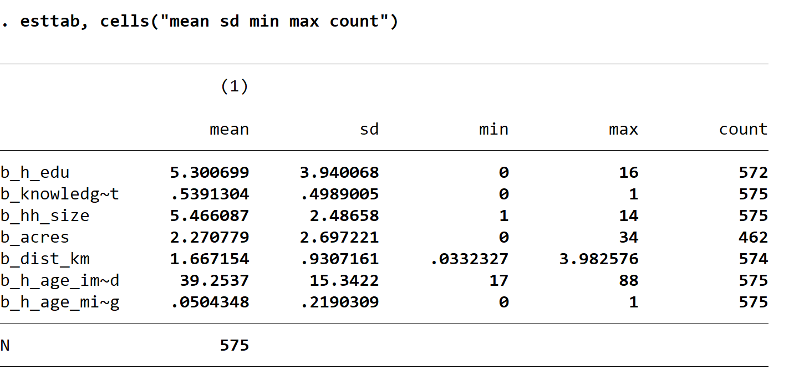

# Summary Statistics Tables

Before you begin, set up a do file that 
downloads data from the paper 
[Price Subsidies, Diagnostic Tests, and Targeting of Malaria Treatment: Evidence from a Randomized Controlled Trial](https://www.aeaweb.org/articles?id=10.1257/aer.20130267) by following the instructions [here](https://pjakiela.github.io/stata/making-tables.html). 

The data set contains seven baseline variables, each of which begins with the prefix `b_*`.  This page explains 
how to make two types of summary statistics tables: one that summarizes the characteristics of the baseline variables (means, 
standard deviations, etc.) and another that checks for covariate balance in the treatment and control groups.  

Before you begin, familiarize yourself with the baseline covariates included in the data set.  Label them 
with short, self-explanatory labels using the `label var` command.  

<br>

## Storing Summary Statistics with `estpost`

The command 
```
summarize b_*
```
will produce summary statistics on all the variables beginning with `b_`.   Immediately after you run 
the summarize command, your results are saved in a collection of local macros and matrices.  You can see 
what is saved by typing 
```
return list
```
immediately after your `summarize` command (or any other command that calculates statistics from data). These locals 
are only stored temporarily; they are over-written as soon as you use another command.  So, you need to save your results somewhere.

Adding the Stata command 
`estpost` before `summarize` will save your results as matrices.  Importantly, this allows you to save 
the summary statistics for multiple variables in a single step.  Specifically, the command 
```
estpost summarize b_*
```
will generate matrices that contain the means, standard deviations, minima, and maxima for all 
the variables beginning with `b_*`.  So, for example, `e(mean)' contains the means of all of the variables 
beginning with `b_* `, which you can 
view using the command
```
matrix list e(mean)
```
The `estpost` command will also save matrices `e(sd)`, `e(Var)`, `e(min)`, `e(max)`, and `e(count)`.

<br>

## Making a Table Using `esttab`

Now that you've stored your summary statistics using `estpost`, you can make a table using Stata's 
`esttab` command - the same `esttab` command that [you use to make a table of regression 
results](https://pjakiela.github.io/stata/regression-table.html).  Using `esttab` to make a 
summary stats table is a bit of a hack:  Stata is looking for regression results saved as 
e-class matrices (which come from regression estimation), but we've used the `estpost` command 
to save our summary statistics in that format.  This allows us to use `esttab` to make 
a polished table that can be exported to word, excel, or latex.  

You can use the command 
```
esttab, cells("mean sd min max count")
```
to create a simple table of summary statistics (like the example below) in Stata's output window.  



This table already lookes pretty good, but we can make it look more professional by using 
some of `esttab`'s options.  The `noobs` options will remove the bottom panel listing the sample size, 
since it is redundant.  The `nonum` option will remove the number `(1)` from the table header.  Adding 
```
nomtitle collabels("Mean" "S.D." "Min." "Max." "N")
``` 
will replace the default column headings (reflecting the names of the e-class matrices included in the table) 
with column headings of our choice.  Finally, we can modify the content of the `cells()` option 
to format each of the columns as we wish by replacing
```
cells("mean sd min max count")
```
with 
```
cells("mean(fmt(%9.2f)) sd min max count(fmt(%9.0g))")
```
This will limit the number of decimal places to two for the first four columns 
while reporting whole numbers in the final column.  


<br>


